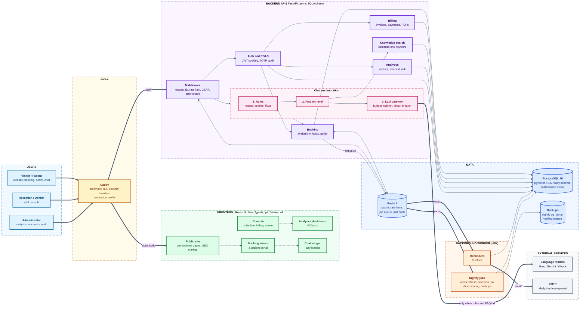

# Meridian Dental Care

**A complete digital front door and back office for a dental clinic: public website, online booking, patient portal, staff console, revenue analytics and a conversational assistant.**

The clinic is fictional and this is a demo environment. The full build plan is in [plan (2).md](<plan (2).md>).

---

## Table of contents

1. [Overview](#overview)
2. [Objectives](#objectives)
3. [What we build](#what-we-build)
4. [How it helps](#how-it-helps)
5. [Architecture](#architecture)
6. [Technology stack](#technology-stack)
7. [Quick start](#quick-start)
8. [Feature guides](#feature-guides)
9. [Security and privacy](#security-and-privacy)
10. [Quality and testing](#quality-and-testing)
11. [Repository layout](#repository-layout)
12. [Project status](#project-status)
13. [Conventions](#conventions)

---

## Overview

Meridian Dental Care is a full stack web platform that takes a dental practice from first search to final invoice. A prospective patient finds the clinic, checks real availability and books in minutes, with or without an account. The reception team runs the day from a live schedule. Dentists see their own list and clinical notes. Administrators see revenue, utilisation and no show risk on one dashboard. A chat assistant answers questions and handles bookings at any hour, and calls a language model only when a rule based answer is not enough.

The system is built as a modular monolith: one API, one background worker, one database and one cache. This keeps operations simple while the code stays divided into clear domains (booking, billing, notifications, knowledge, chat, analytics).

## Objectives

| # | Objective | How it is measured |
|---|---|---|
| 1 | Let patients book, reschedule and cancel without a phone call | Complete booking in a few steps, no double bookings under concurrency |
| 2 | Cut no shows and front desk workload | Automated reminders, confirm and cancel links, no show risk scoring |
| 3 | Give management trustworthy numbers | Every metric defined once in [docs/metrics.md](docs/metrics.md) and reconciled with SQL in tests |
| 4 | Answer routine questions instantly and cheaply | Most chat turns use zero model calls, with budgets and failover for the rest |
| 5 | Protect patient data | Role based access, field encryption, audit log, retention and anonymisation |
| 6 | Stay fast and accessible | Read endpoints under 300 ms p95, WCAG checks on every public page |
| 7 | Be easy to run and verify | One command to start, CI gates for lint, types, tests, scans and builds |

## What we build

| Area | Capabilities |
|---|---|
| **Public website** | Services, dentists, pricing, FAQ, contact, structured data for search engines, prerendered pages, Lighthouse audit |
| **Booking** | Live availability, short slot holds, guest and patient booking, rescheduling, cancellation policy, calendar files |
| **Patient portal** | Appointments, invoices and receipts, notification centre, profile and consent, data export and erasure |
| **Staff and admin console** | Front desk schedule, check in, visit completion, patient records, billing desk, schedules and exceptions, accounts, audit log |
| **Billing** | Invoices, discounts, insurance estimates, sandbox card payments, PDFs, receivables aging |
| **Notifications** | Reminder emails, one click confirm and cancel links, nightly jobs, retries |
| **Knowledge base** | 68 documents and intent examples, embedded with pgvector for semantic search |
| **Chat assistant** | FAQ answers, booking, reschedule and cancel by conversation, safety filters, degraded mode when models are unavailable |
| **LLM gateway** | One entry point to the language models with budgets, failover and a circuit breaker |
| **Analytics** | Materialized views, revenue forecast, no show model, an eight tab dashboard |

## How it helps

| For | Benefit |
|---|---|
| **Patients** | Book at any hour, see only real free times, get reminders and one tap confirm or cancel, find invoices and receipts in one place |
| **Reception** | One live schedule, fewer phone calls, fewer empty chairs, fast check in and billing |
| **Dentists** | Their own day, patient history and notes, nothing they do not need to see |
| **Practice owners** | Revenue, forecast, utilisation and no show risk with definitions they can audit |
| **Engineering** | Typed API client generated from OpenAPI, strict types, reproducible environments, security scans in CI |

## Architecture

The diagram shows the end to end flow, from the visitor's browser to the data stores, background work and external services.



**Reading the diagram**

- **Thick arrows** are the main request path and the outbound calls. **Dotted arrows** are navigation inside the browser application.
- In development the Vite server proxies `/api` to the API, so the browser sees one origin and cookies behave as they will in production.
- The chat assistant tries **rules first, then FAQ retrieval, then a language model**. Most turns never reach the model, which keeps latency and cost low.
- Dependencies reachable from a request (settings, engine, session factory, Redis) are created in the application lifespan, so tests share no global state.

More detail is in [docs/architecture.md](docs/architecture.md).

## Technology stack

| Layer | Technology |
|---|---|
| Frontend | React 18, Vite, TypeScript (strict), Tailwind v4, Radix based components, ECharts |
| Backend | Python 3.12, FastAPI, async SQLAlchemy, Alembic, Pydantic settings |
| Data | PostgreSQL 16 with pgvector, Redis 7 |
| Background work | ARQ worker and scheduler |
| Language models | Groq first, Gemini as fallback, behind one gateway |
| Delivery | Docker Compose, Caddy with automatic TLS |
| Quality | pytest, Vitest, Playwright, axe, ruff, mypy, ESLint, k6 |
| Security tooling | Bandit, pip-audit, npm audit, Trivy, gitleaks |

## Quick start

Requirements: Docker with Compose v2. For local tooling outside Docker: Python 3.12 with [uv](https://docs.astral.sh/uv/) and Node.js 22 or later.

```bash
cp .env.example .env      # optional, defaults work for development
docker compose up --build
```

| Service | Default address |
|---|---|
| Web (Vite dev server) | http://localhost:5173 |
| API | http://localhost:8000 (docs at `/docs`) |
| Health and readiness | http://localhost:8000/health and `/ready` |
| Mailpit inbox | http://localhost:8025 |
| PostgreSQL 16 with pgvector | localhost:5432 |
| Redis 7 | localhost:6379 |

If a host port is already in use, override it in `.env` with `API_PORT`, `WEB_PORT`, `DB_PORT`, `REDIS_PORT`, `MAILPIT_UI_PORT` or `MAILPIT_SMTP_PORT`.

The production profile adds Caddy with automatic TLS and security headers:

```bash
SITE_ADDRESS=clinic.example.com docker compose --profile production up -d --build
```

### Development without Docker

```bash
# Backend
cd backend
uv sync
uv run uvicorn app.main:app --reload
uv run pytest

# Frontend
cd frontend
npm ci
npm run dev
```

Regenerate the typed API client after changing backend schemas:

```bash
cd frontend && npm run gen:api
```

### Demo data

```bash
cd backend
uv run alembic upgrade head
uv run python -m scripts.seed            # 24 months of demo data
uv run python -m scripts.train_no_show   # train the no show model
uv run python -m scripts.embed_kb        # index the knowledge base
```

## Feature guides

| Topic | Guide |
|---|---|
| Database schema and migrations | [docs/database.md](docs/database.md) |
| Booking, holds, cancellation policy | [docs/booking.md](docs/booking.md) |
| Billing and payments | [docs/billing.md](docs/billing.md) (clinic details on invoices come from `CLINIC_NAME`, `CLINIC_ADDRESS`, `CLINIC_PHONE`, `CLINIC_EMAIL`) |
| Notifications and nightly jobs | [docs/notifications.md](docs/notifications.md) |
| Knowledge base | [docs/knowledge-base.md](docs/knowledge-base.md) |
| LLM gateway | [docs/llm-gateway.md](docs/llm-gateway.md) (check real keys with `uv run python -m scripts.llm_smoke`) |
| Chat assistant | [docs/chatbot.md](docs/chatbot.md) and [docs/chat-widget.md](docs/chat-widget.md) |
| Analytics and metric definitions | [docs/analytics.md](docs/analytics.md) and [docs/metrics.md](docs/metrics.md) |
| Frontend and design system | [docs/frontend.md](docs/frontend.md) (open `/styleguide` in development) |
| Public website and audit | [docs/website.md](docs/website.md) (`npm run audit:site`) |
| Booking wizard and patient portal | [docs/booking-and-portal.md](docs/booking-and-portal.md) |
| Staff and admin console | [docs/console.md](docs/console.md) |
| Analytics dashboard | [docs/analytics-dashboard.md](docs/analytics-dashboard.md) |

## Security and privacy

Patients register at `POST /api/v1/auth/register` and confirm their email (the message appears in Mailpit at http://localhost:8025). Admin and dentist accounts must enrol an authenticator app (TOTP) on first sign in. The design and ASVS review are in [docs/security.md](docs/security.md).

Generate an encryption key for personal data fields (required in production):

```bash
cd backend && uv run python -m scripts.generate_encryption_key k1
```

## Quality and testing

| Area | Command |
|---|---|
| Backend lint and format | `uv run ruff check . && uv run ruff format --check .` |
| Backend types | `uv run mypy app tests scripts` |
| Backend tests | `uv run pytest` |
| Database tests | `uv run pytest tests/db` (needs the db service) |
| Backend security | `uv run bandit -q -c pyproject.toml -r app` and `uv run pip-audit` |
| Frontend lint and format | `npm run lint && npm run format:check` |
| Frontend types, tests, build | `npm run typecheck && npm test && npm run build` |
| Browser tests | `npm run test:e2e` |
| Repository text rules | `python scripts/check_text_rules.py` |

Install the git hooks once with `pre-commit install`. CI runs the same checks plus Trivy and gitleaks.

## Repository layout

```
backend/    FastAPI application, ARQ worker, tests
frontend/   React, Vite, TypeScript, Tailwind, shadcn/ui
data/       knowledge base, reference and generated datasets
infra/      Docker Compose file, Caddyfile, backup scripts
perf/       k6 load test scenarios
docs/       architecture, conventions and runbooks
scripts/    repository level tooling
```

## Project status

Phases 1 to 16 are complete: foundations, database, authentication, booking, billing, notifications, knowledge base, LLM gateway, chat orchestration, analytics backend, frontend foundation, public website, booking wizard and portal, staff and admin console, analytics dashboard and the chat widget. Phase 17 (testing, security hardening and performance) is in progress.

## Conventions

See [docs/conventions.md](docs/conventions.md) for the branch strategy, commit format and content rules.
